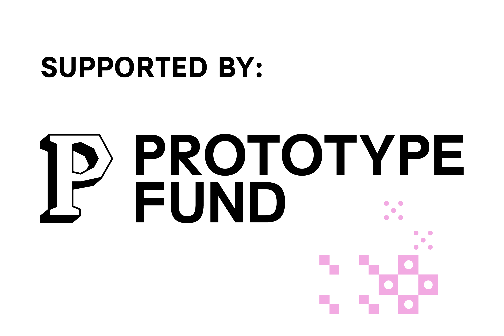

# openinvoicexml

[](https://github.com/HongbaeKim/openinvoicexml/actions/workflows/ci.yml)

An open-source TypeScript library for generating compliant German electronic invoices — XRechnung UBL XML, CII XML, and hybrid PDF/A-3 (including genuine Factur-X/ZUGFeRD, EN16931/XRechnung profiles).

From 2028 onward, all domestic B2B invoices in Germany must be issued as structured electronic invoices. This library handles the full pipeline: structured JSON input → validated XRechnung XML → hybrid PDF with embedded XML.

Funded by [Prototype Fund](https://www.prototypefund.de/projects/openinvoicexml) (June–November 2026).

## What it does

- Generates XRechnung 3.x compliant UBL 2.1 XML from a structured JSON invoice
- Validates output against KoSIT (the official German e-invoice validator)
- Exports hybrid PDF/A-3b: `toHybridPdf()` embeds the XRechnung UBL XML as an associated file
  (veraPDF-validated); `toFacturXPdf()` embeds CII via `embedFacturX()` for a genuine
  Factur-X/ZUGFeRD conformance claim (`EN16931`/`XRECHNUNG` profiles — see
  [docs/LIMITATIONS.md](docs/LIMITATIONS.md) for the MINIMUM/BASIC WL/BASIC gap), validated
  against KoSIT, veraPDF, and Mustang
- `generateInvoiceDocument(invoice, { format })` gives one call site across all four output
  formats — XRechnung UBL, XRechnung CII, Factur-X/ZUGFeRD EN16931, Factur-X/ZUGFeRD XRechnung —
  without callers needing to know which adapter or `profile` value each one maps to
- Covers major German VAT and legal scenarios: [§19][ustg-19] small business, [§13b][ustg-13b] reverse charge, intra-EU supply, credit notes, down payment invoices, and more

## Status

Early development — Phase 2 (XML Engine & Validation) in progress: XRechnung XML generation is implemented and validated locally against the official KoSIT validator (see [docs/COMPLIANCE.md](docs/COMPLIANCE.md#validating-this-projects-output)). See [docs/ROADMAP.md](docs/ROADMAP.md) for the full plan.

## Prerequisites

- Node.js 20+
- npm 10+

## Install

```bash
npm install
```

## Run tests

```bash
npm test
```

CI (`.github/workflows/ci.yml`) also runs `npm run lint` and `npm run typecheck` on every push
and PR to `main`.

## Project structure

```
/core         — internal invoice schema and normalization
/adapters     — output adapters (XRechnung XML, PDF/A-3)
/validators   — validation layer (schema, KoSIT, veraPDF)
  /rules      — individual business rule implementations
/fixtures     — example invoices and expected outputs
/docs         — architecture, roadmap, and API docs
```

## Docs

| Document                                                                                                      | Status |
| ------------------------------------------------------------------------------------------------------------- | ------ |
| `ARCHITECTURE.md` — Adapter pattern, module boundaries, data flow, backend/frontend folder conventions        | Done   |
| `DEVELOPMENT.md` — Local setup, available commands, TypeScript/dependency config, coding & commit conventions | Done   |
| `COMPLIANCE.md` — Index of compliance sources, rule → file → status map, KoSIT validation setup and usage     | Done   |
| `DATA-MODEL.md` — Internal invoice schema, full XRechnung BT mapping table, hosted-platform DB schema         | Done   |
| `API.md` — API usage: `generateInvoiceDocument`, `generateInvoice`, `toXRechnung`, error codes                | Done   |
| `ROADMAP.md` — Phase goals, non-goals, open questions                                                         | Done   |
| `LIMITATIONS.md` — What is not supported and why                                                              | Done   |
| `SECURITY.md` — Security considerations and responsible disclosure                                            | Done   |

## License

Apache-2.0

---

<p>
  
  
</p>

[ustg-13b]: https://www.gesetze-im-internet.de/ustg_1980/__13b.html
[ustg-19]: https://www.gesetze-im-internet.de/ustg_1980/__19.html
